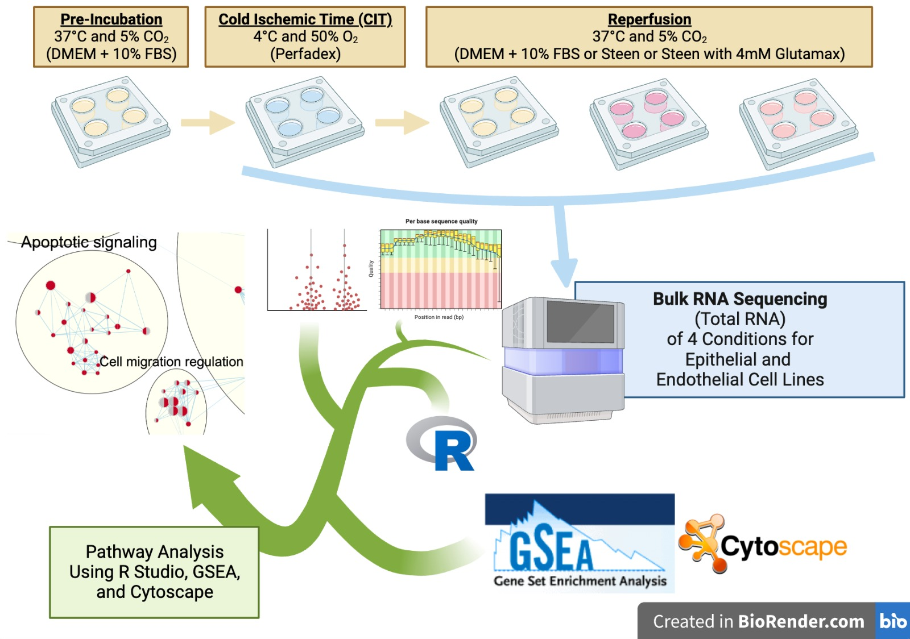

# [Epithelial and Endothelial Responses to Different Perfusion Solutions - Manuscript in Preparation]

Jamie Jeon, Aaron Wong, Lei Huang

A processing pipeline for bulk RNA seq studying the effects of reperfusion of different solutions on human pulmonary epithelial and endothelial cells cultured in vitro. Manuscript under preparation...

Pseudoalignment conducted by Kallisto
Quantification and gene level abundance using tximport
Differential gene expression by DeSeq2
Gene set Enrichment Analysis (GSEA) for pathway analysis
Various plots generated by ggplot2
Other scripts for figures to be added...

